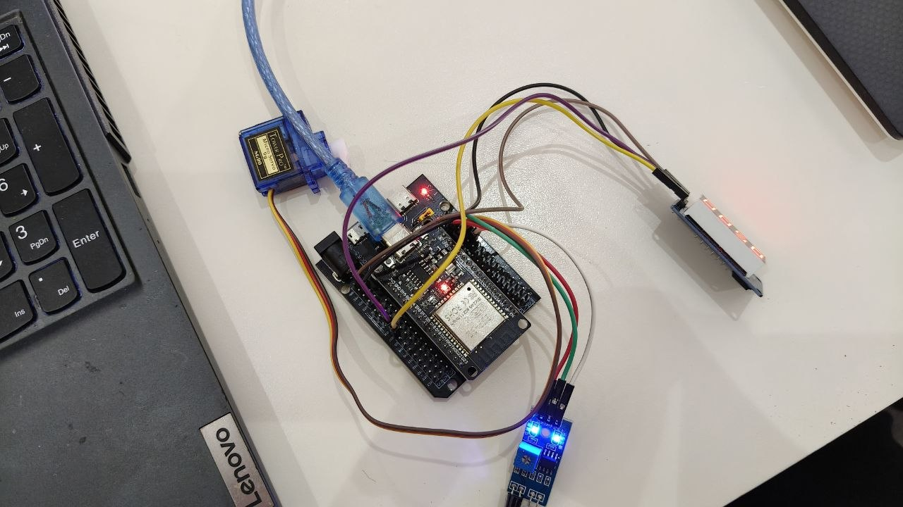

# LAB 3: IoT Smart Gate Control with Blynk, IR Sensor, Servo Motor, and TM1637

## 1. Project Overview

This project is an ESP32-based IoT Smart Gate Control System developed using MicroPython and the Blynk platform.

The system integrates an IR sensor for object detection, a servo motor for gate movement, and a TM1637 4-digit display for real-time feedback. Blynk is used to monitor the IR sensor, control the servo motor remotely, display the detection count, and switch between Automatic and Manual operating modes.

The project demonstrates the interaction between sensors, actuators, cloud-based controls, and a local display.

---

## 2. Objectives

The main objectives of this project are to:

- Read an IR sensor and display its detection status on Blynk.
- Control a servo motor using a Blynk slider.
- Automatically open and close the gate based on IR detection.
- Count detection events and display the count on the TM1637 and Blynk.
- Implement Automatic and Manual operating modes.
- Document the system wiring, Blynk dashboard, controls, and operation.

---

## 3. Hardware Components

The following components are used in this project:

- ESP32 development board with MicroPython firmware
- IR obstacle detection sensor
- SG90 servo motor
- TM1637 4-digit 7-segment display
- Breadboard
- Jumper wires
- USB cable
- Laptop with Thonny
- Wi-Fi connection
- Blynk account

---

## 4. Wiring

The hardware is connected to the ESP32 according to the wiring diagram provided in the lab instructions.

| Component | Connection | ESP32 Pin |
|---|---|---|
| IR Sensor | OUT | GPIO 12 |
| IR Sensor | VCC | 5V |
| IR Sensor | GND | GND |
| Servo Motor | Signal | GPIO 13 |
| Servo Motor | VCC | 5V |
| Servo Motor | GND | GND |
| TM1637 | DIO | GPIO 16 |
| TM1637 | CLK | GPIO 17 |
| TM1637 | VCC | 5V |
| TM1637 | GND | GND |

### Wiring Diagram

## 5.1 - IR Sensor Monitoring 
- Read the digital output of the IR sensor using the ESP32.
- Display the sensor status (Detected / Not Detected) on Blynk.
- Update the status whenever the sensor state changes.
-[Task 1 demonstration](https://youtube.com/shorts/AKrm4FPZqSc?si=9n-QfrEfLWO4xv4s)

## 5.2 - Blynk-Controlled Servo 
- Add a Blynk slider with a range from 0 to 180 degrees.
- Moving the slider must change the servo angle.
- Display the selected angle in the Blynk app.
-[Task 2 demonstration](https://youtube.com/shorts/pM4rxQNJ0aw?si=mfQMsJCW9s0K6JCH)

## 5.3 - Automatic IR Gate Operation
- When an object is detected by the IR sensor, the servo must open the gate.
- After a short delay, the servo returns to the closed position.
- Trigger each opening once per new detection, not repeatedly while an object remains present.
-[Task 3 demonstration](https://youtube.com/shorts/d7YLj6YBAmo?si=gVkPvpzUFnnSiIcq)

## 5.4 - TM1637 Detection Counter
- Count each new IR detection event.
- Display the count on the TM1637 display.
- Send the same count to a Blynk numeric display widget.
-[Task 4 demonstration](https://youtube.com/shorts/Oq6dVww26rQ?si=pDRdSaCvFkfOnJu8)

## 5.5 - Complete Smart Gate Integration
- Combine all previous tasks into one ESP32 program and one Blynk dashboard.
- Add a switch in Blynk to select Automatic or Manual mode.
- In Automatic mode, the IR sensor controls the gate. In Manual mode, the IR sensor does not move the servo; use the Blynk slider instead.
- Keep the IR status and detection counter visible on Blynk.
-[Task 5 demonstration](https://youtube.com/shorts/Iotd7oYG1hU?si=pSPlknU5i3-SnxuP)
